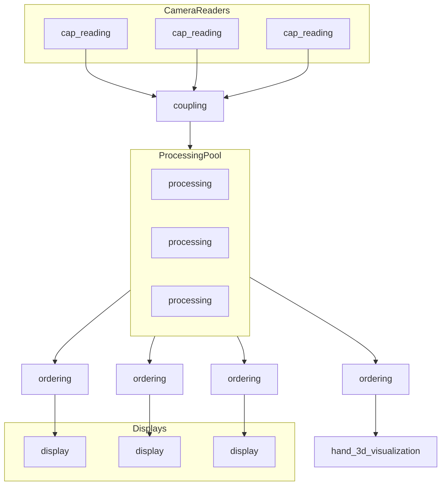

## Top-level functional diagram

TODO: add ik pool

```mermaid
flowchart TD
    subgraph CameraReaders
        cap1[cap_reading]
        cap2[cap_reading]
        capN[cap_reading]
    end

    cap1 --> coupling[coupling]
    cap2 --> coupling
    capN --> coupling

    coupling --> ProcessingPool

    subgraph ProcessingPool
        processing1[processing]
        processing2[processing]
        processingM[processing]
    end

    ProcessingPool --> hand_points_sorter[ordering]
    ProcessingPool --> display_ordering1[ordering]
    ProcessingPool --> display_ordering2[ordering]
    ProcessingPool --> display_orderingN[ordering]

    hand_points_sorter --> hand_3d_visualizer[hand_3d_visualization]

    display_ordering1 --> display1[display]
    display_ordering2 --> display2[display]
    display_orderingN --> displayN[display]

    subgraph Displays
        display1
        display2
        displayN
    end
```